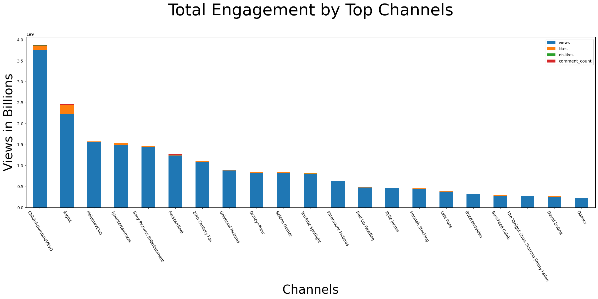

# DAI5 EDA Case Study: Youtube Analytics

### Authors:

  * Makhi Richburg
  * Joel Himes
  * Robert Ebend
  * Ben MacDonald

## Project Goal 

* Finding the top 5 categories to advertise to.

* Finding top 5 channels per category to advertise to.

* Visualize overall engagement by channel

## Benefit of Exploratory Data Analysis

* Knowing this will help us make more strategically targeted decisions

* Company can choose which criteria they want for direction of ad revenue

* Company can gain more reach in specific sectors.

## Describe the data

* The data consists of metrics related to individual videos uploaded to Youtube.

## 	What features (columns) did you have to work with? 

There are 16 columns:

* video_id
* trending_date
* title
* channel_title
* category_id
* publish_time
* tags
* views
* likes
* dislikes
* comment_count
* thumbnail_link
* comments_disabled
* rating_disabled
* video_error_or_removed
* description

## What features were you interested in?

* Views

* Likes

* Dislikes (engagement meter)

* Categories

* Channels

## Were the features numerical/categorical/text?

* A mixture of all three
(bool / numerical / categorical / object (str))

## Was a lot of data missing? (If so, what did you do to handle it?)

* There was a no missing data observed while the team was specifically viewing the US dataset. 

## How did features relate to each other, and the values that you were interested in?

* Noticeable relationships between views, channels, and categories

* There are many other subcomponents of those videos and channels to include likes, dislikes, and comment count that have impactful relationships on the aforementioned

## Use plots to clearly communicate the data's story to stakeholders.

        

